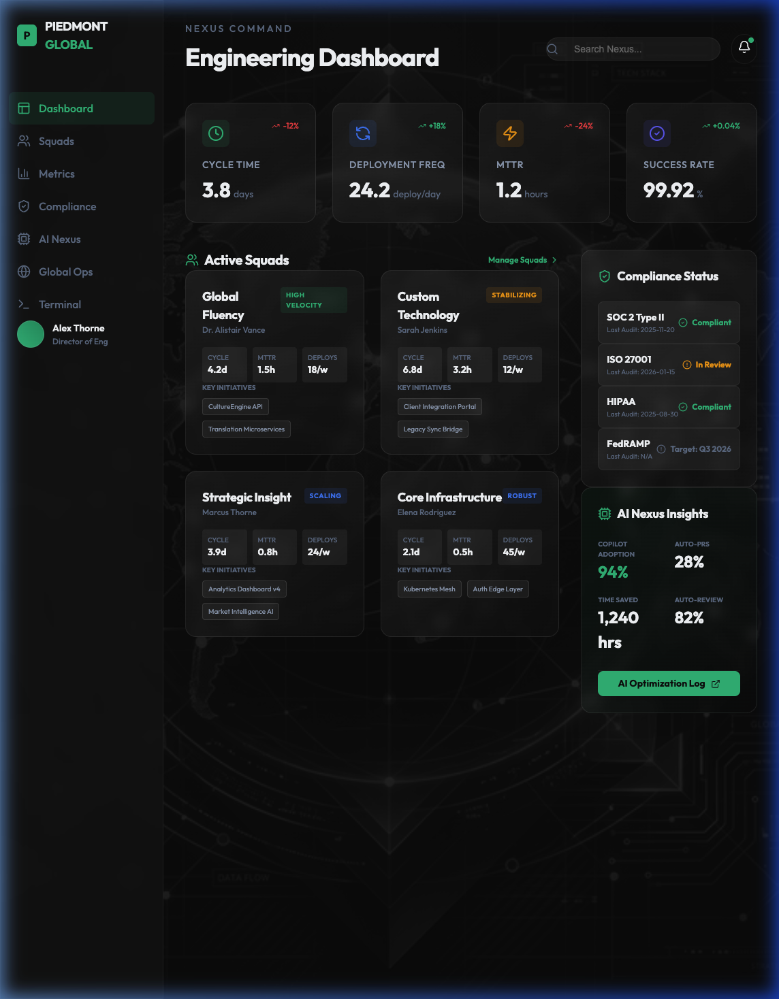

# Strategic Nexus: Engineering Dashboard

A high-end, premium command center for engineering leadership. This dashboard provides a consolidated view of organizational health, focusing on DORA metrics, squad velocity, and strategic initiatives.



## 🚀 Key Features

*   **Executive Insights**: Bird's-eye view of Cycle Time, Deployment Frequency, and MTTR.
*   **Operational Transparency**: Real-time status tracking for high-velocity engineering squads.
*   **AI Integration**: Monitoring for GitHub Copilot adoption and AI-driven optimizations.
*   **Compliance Control**: Centralized visibility for SOC 2, ISO 27001, and HIPAA status.

## 🛠 Tech Stack

*   **Core**: React 18, Vite, TypeScript
*   **Styling**: Bespoke Vanilla CSS (Glassmorphism design system)
*   **Animations**: Framer Motion
*   **Icons**: Lucide React

## 📦 Getting Started

1.  **Install dependencies**:
    ```bash
    npm install
    ```

2.  **Run locally**:
    ```bash
    npm run dev
    ```

3.  **Build for production**:
    ```bash
    npm run build
    ```

## 🔒 Security & Privacy

This project has been scrubbed of all specific corporate references to ensure safe public distribution while maintaining professional operational patterns.
